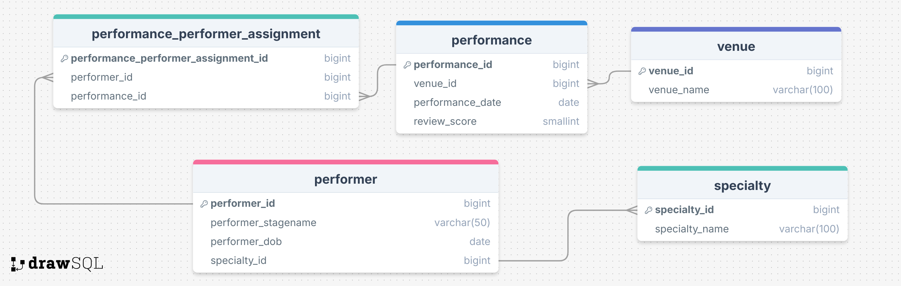

# Time-Traveling Circus Performers Database

## Scenario

You’ve been hired by a mysterious organization that operates a time-traveling circus. Their mission is to entertain audiences across different eras, wowing them with dazzling acts from the past, present, and future. The organization's database, stored in PostgreSQL, keeps track of their various performers, performances, and venues.

As a newly recruited developer, your job is to develop an API to allow easy access to this database. The previous developer left abruptly after a vanishing act went awry, leaving the API half-finished.

Complete the tasks listed below to enhance the API. Your work will involve both SQL and Python, with an emphasis on keeping data processing within the database.

## Setup and Installation

1. Navigate to the `time_circus` folder.
2. Create and activate a new virtual environment.
3. Run `pip install -r requirements.txt` to install the required libraries.
4. Run `psql postgres -c "CREATE DATABASE time_circus;"` to create the database.
5. Run `psql time_circus -f setup-db.sql` to create and populate the initial database tables.

## Development

Run the server with `python3 api.py`; you can access the API on port `8000`.

Reset the database at any time with `psql time_circus -f setup-db.sql`.

## Quality Assurance

Check the code quality with `pylint *.py`.

Run tests with `pytest -vv`.

## Data Model



The `time_circus` database has four tables:

- `performer` for records of individual circus performers.
- `performance` for details of each performance.
- `venue` for the various venues where performances take place.
- `performance_performer_assignment` links performances and performers
- `specialty` for the different types of acts a performer specialises in

# Tasks

The work required of you has been subdivided into a series of tasks. These tasks should help improve both the functionality and usability of the API.

There is an **incomplete** test suite available to guide your code. Having all tests passing does not necessarily mean that the API has all required functionality.
You will be assessed on the following areas:
- Functionality
- Passing tests
- Code quality

The test suite relies on a single global database connection created within the `if __name__ == '__main__'` block.

# Do not create any new connections in your code; always use the global connection.
# DO NOT CLOSE THE GLOBAL CONNECTION.

The tasks involve both Python and SQL; as much as possible, **data processing should be done using SQL**.

## Task 1: Create the base API routes

### a) `/performers`

A `GET` request to the `/performers` endpoint should return a list of performers (see example below). Each object should contain the following information only:

- Performer ID
- Performer Name
- Birth Year
- Specialty

Users should be able to pass in a `sort` parameter to sort by `birth_year`, `specialty`, or `performer_name`. For example, the route `/performers?sort=specialty` will sort the response by `specialty`. The default sort order should be `birth_year`. 

Users should also be able to pass in an `order` parameter to choose between `ascending` and `descending`. The default should be `descending`.

Invalid parameter values should return an error message of the form:

```json
  {
    "error": True,
    "message": "A specific message"
  }
```

#### Example response:

```json
[
  {
    "performer_id": 1,
    "performer_name": "The Amazing Zoltar",
    "birth_year": 1885,
    "specialty": "Fire Breathing"
  },
  {
    "performer_id": 2,
    "performer_name": "Mesmeralda",
    "birth_year": 1920,
    "specialty": "Mind Reading"
  }
]
```

### b) `/venues`

A `GET` request to the `/venues` endpoint should return a list of venues (see example below). Each venue should contain the following information only:

- Venue ID
- Venue Name

#### Example response:

```json
[
  {
    "venue_id": 1,
    "venue_name": "Grand Circus"
  },
  {
    "venue_id": 2,
    "venue_name": "Cleopatra's Castle"
  }
  {
    "venue_id": 3,
    "venue_name": "McDonald's"
  }
]
```

### c) `/performances`

A `GET` request to the `/performances` endpoint should return a list of objects (see example below). Each object should contain the following information only:

- Performance ID
- Performer Name
- Performance Date
- Venue Name
- Review Score

Dates should be expressed in `YYYY-MM-DD` format.

Performances should be sorted in descending order by date.

*Note: Multiple performers may have appeared at the same event; there should be one object for each separate performer at each event here.*

#### Example response:

```json
[
  {
    "performance_id": 1,
    "performer_name": "The Amazing Zoltar",
    "performance_date": "2024-01-01",
    "venue_name": "Roman Colosseum",
    "score": 50
  },
  {
    "performance_id": 2,
    "performer_name": "Mesmeralda",
    "performance_date": "2023-12-25",
    "venue_name": "Grand Central Terminal",
    "score": 99
  },
  {
    "performance_id": 17,
    "performer_name": "Dimension Dan",
    "performance_date": "5500-08-08",
    "venue_name": "Venus Sky Dome",
    "score": 97
  },
  {
      "performance_id": 17,
      "performer_name": "Cascadia",
      "performance_date": "5500-08-08",
      "venue_name": "Venus Sky Dome",
      "score": 97
  }
]
```

### d) `/performances/<performance_id>`

A `GET` request to the `/performances/<id>` endpoint should return a single performance (see example below). If a performance cannot be found, an error should be returned. Each object should contain the following information only:

- Performance ID
- Performer Name(s)
- Performance Date
- Venue Name
- Review Score
  
*Note: Multiple performers may have appeared at the same event; the names of all present performers should be displayed in a list. Importantly, this is a _different_ presentation to the /performances route.*

### Example response

```json
{
  "performance_id": 1,
  "performer_names": ["Mesmeralda", "The Amazing Zoltar"],
  "venue_name": "Grand Circus",
  "performance_date": "2024-03-01",
  "score": 2
}
```

## Task 2: Fix the inelegant route

The previous developer who worked on this project was lost in the mid-to-late 9th Century before they finished writing the `/performer_specialty` route. It contains several errors and is, simply put, just inefficient. Rewrite this using *best practices*

## Task 3: Adding a new route to the API

A `POST` request to the `/performances` endpoint should log details of a new performance. The request body should contain the following keys:

- Performer ID(s) as a `list`
- Performance Date
- Venue Name
- Review Score

*Note Again: There may be more than one performer in the performance!*

### Example request

```json
{
  "performer_id": [3, 5],
  "performance_date": "2024-03-01",
  "venue_name": "The Guggenheim",
  "review_score": 3
}
```

### Task 4: Use a Complex Join

A `GET` request to the `/performers/summary` endpoint should return a list of performers along with the number of performances they have had and their average scores for each type of act. Each object should contain the following information only:

- Performer ID
- Performer Name
- Total Number of Performances
- Average Review Score (rounded to 2 decimals)


Objects should be ordered by the total number of performances in descending order.

#### Example response

```json
[
  {
    "performer_id": 1,
    "performer_name": "The Amazing Zoltar",
    "total_performances": 5,
    "average_review_score": 4.2
  },
  {
    "performer_id": 2,
    "performer_name": "Mesmeralda",
    "total_performances": 3,
    "average_review_score": 1.1
  }
]
```
